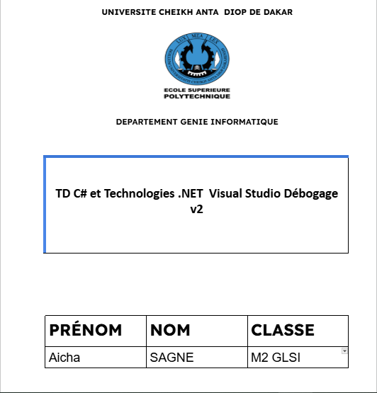
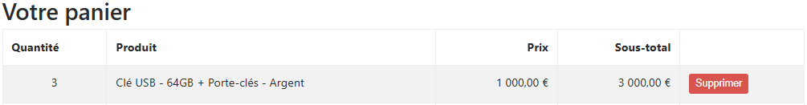
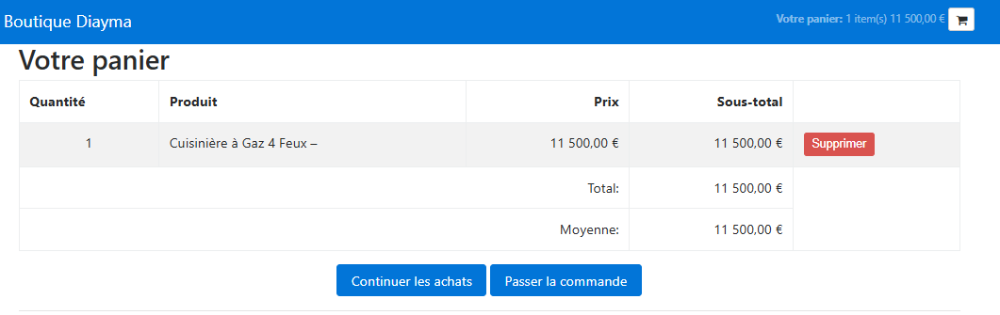
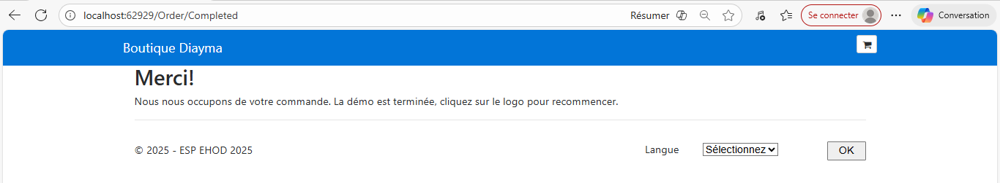
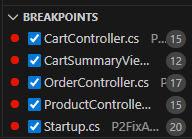
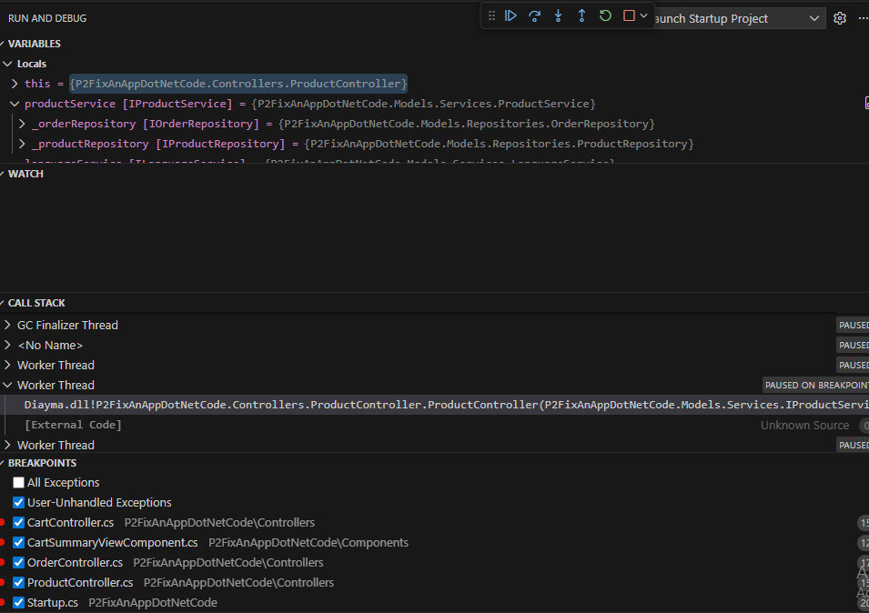
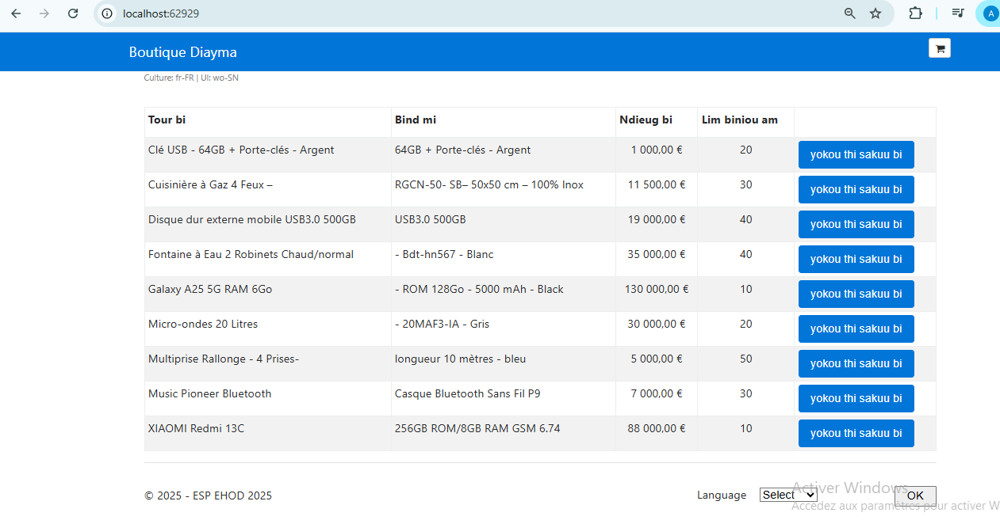
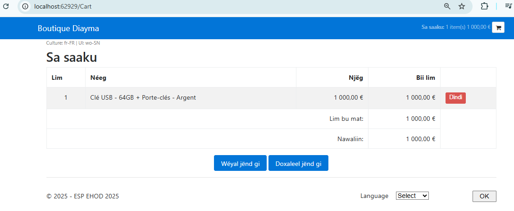
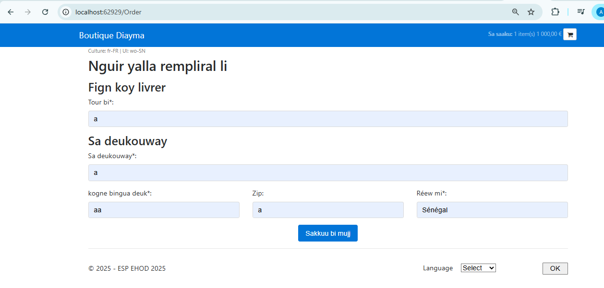
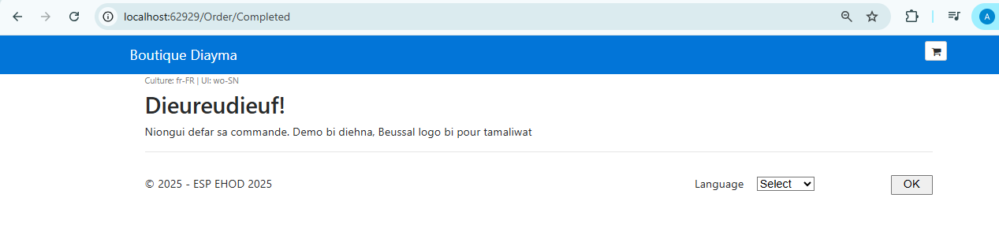

# Tâche 2 : Projets de la solution
La solution contient un seul projet : **Diayma**

# Tâche 3 : Version SDK .NET utilisée
En analysant la balise <TargetFramework> dans le fichier Diayma.csproj:

Voici la section qui nous interesse 
  #  <PropertyGroup>
  #   <TargetFramework>netcoreapp2.0</TargetFramework>
  #  </PropertyGroup>

Et si on se base sur la section la version du SDK .NET utilisée par le projet est **.NET Core 2.0.**

# Tâche 4 : Installez le SDK 
J'ai installer le SDK  en utilisant ce lien :
[https://dotnet.microsoft.com/en-us/download]

# Tâche 5 : Créez votre propre dépôt GitHub pour y stocker le code 
J'ai cree mon propre depot accessible a ce lien:
[https://github.com/Aichasagne/DiaymaBoutique.git]

# Tâche 6 : Explorez l’application. Signalez 2 bugs trouvés ? 
Apres exploration voici les bugs que j'ai trouve

**Bug 1 :** 
Gestion incorrecte de la suppression des articles dans le Panier. En mode panier, cliquer sur l'option de suppression d'un article retire toute la quantite ajouter au panier. 

Apres avoir cliquer sur supprimer voici l'etat du panier

**Bug 2 :** 
Lors de la finalisation de la commande, l'application affiche un message de "Démo est terminée". Ceci est la preuve que le fichier Startup.cs (ligne 20) est configuré pour injecter un service fictif (Mock Repository) à la place du véritable service de persistance, rendant le système incapable d'enregistrer réellement les commandes.

# Tâche 7 : Placez un point d’arrêt sur les lignes suivantes du code 

# Tâche 8 : Quels sont les namespaces, classes et méthodes visités avant l’affichage des produits sur l’écran  d’accueil de votre navigateur ? Choisissez le mode approprié selon le contexte, "Pas à pas  détaillé", "Pas à pas principal" ou "Pas à pas sortant"

**1. Mode de Débogage**
Le mode le plus approprié est le Pas à pas principal (F10).
**Justification :** 
Ce mode était le plus approprié car il permet de sauter le code interne du Framework .NET et de se concentrer uniquement sur le code de l'application Diayma pour documenter son flux logique.

**2. Le Chemin Visité**
Le flux d'exécution se déroule en trois étapes principales, passant par les classes et méthodes suivantes :

**Étape 1** 
Le programme commence dans le Namespace Diayma :

**Classe :** Program

**Méthodes :** Main() puis BuildWebHost() (Lance le serveur)

**Étape 2 :** 
Le contrôle passe au Namespace Diayma pour l'initialisation :

**Classe :** Startup

**Méthodes :**

Startup(IConfiguration) 

ConfigureServices(IServiceCollection) 

Configure(IApplicationBuilder, IHostingEnvironment) 

**Étape 3 :** 
Le Framework effectue le routage ([External Code]) et appelle le contrôleur :

**Namespace :** P2FixAnAppDotNetCode.Controllers

**Classe :** ProductController

**Méthodes :**

ProductController(...) (Le constructeur est appelé pour l'Injection des services)

List() (L'action est exécutée pour charger les produits et la vue)

# Tâche 9 : Déployez votre solution sous forme d’exécutable Windows. 

Pour réaliser cette tâche, nous avons utilisé la commande .NET CLI (dotnet publish) avec des options spécifiques qui définissent le mode de déploiement :
**dotnet publish Diayma.csproj -c Release -r win-x64 --self-contained true**

**dotnet publish :** Commande fondamentale pour compiler l'application en vue de sa distribution.
**-c Release :** Spécifie la configuration de production (version optimisée).
**-r win-x64 :** Définit la plateforme cible : Windows 64-bit.
**--self-contained trueCrucial :** Cette option ordonne à l'outil de publier l'application avec le runtime .NET Core 2.0 intégré . Cela garantit que l'application fonctionne même si la version 2.0 du Framework n'est pas installée sur la machine cible.

Le processus a créé un dossier publish dans le chemin : ...**\P2FixAnAppDotNetCode\bin\Release\netcoreapp2.0\win-x64\publish.**
Ce dossier contient l'exécutable (Diayma.exe) ainsi que tous les fichiers dépendants (vues, CSS, configurations, DLL) qui sont essentiels au bon fonctionnement de l'application web.

# Tâche 10 : Fournir un lien drive Google, Onedrive etc. à l’exécutable ci-dessus. 

Voici le lien drive ou on trouvera l'executable:
[https://drive.google.com/drive/folders/1Kji99evADtR0Out8lsWipbHJ2nkJOltT?usp=drive_link]

# Tâche 11 : Ajoutez une langue d’affichage à l’interface, Wolof par exemple. Conservez les options de  culture du français

Le support de la langue Wolof a été ajouté à l'application en utilisant le code de culture spécifique wo-SN (Wolof - Sénégal). Cette implémentation a nécessité des ajustements critiques pour garantir une expérience utilisateur fluide :

**Logique de Culture Séparée :** La méthode UpdateCultureCookie dans LanguageService.cs a été corrigée pour séparer la culture d'affichage (uic=wo-SN) de la culture de formatage des nombres, dates et devises (c=fr-FR), assurant ainsi un formatage financier cohérent avec les standards régionaux.

**Alignement des Ressources :** Tous les fichiers de ressources spécifiques à cette langue ont été créés ou renommés en utilisant le suffixe .wo-SN.resx (ex : Index.wo-SN.resx, LanguageViewModel.wo-SN.resx).

**Mise à Jour de la Configuration :** Le fichier Startup.cs a été mis à jour pour déclarer explicitement le support des cultures wo-SN et fr-FR au sein de RequestLocalizationOptions.

**Nouveaux Fichiers Ajoutés :** De nouveaux fichiers .wo-SN.resx ont été ajoutés aux dossiers Resources/Views/Cart, Resources/Views/Order, Resources/Controllers, et Resources/Models/ViewModels pour permettre la traduction complète du parcours utilisateur (Catalogue, Panier, Commande, et validation des données).

**page catalogue traduite en wolof**

**page panier traduite en wolof**

**page commande traduite en wolof**

**page commande complete traduite en wolof**

